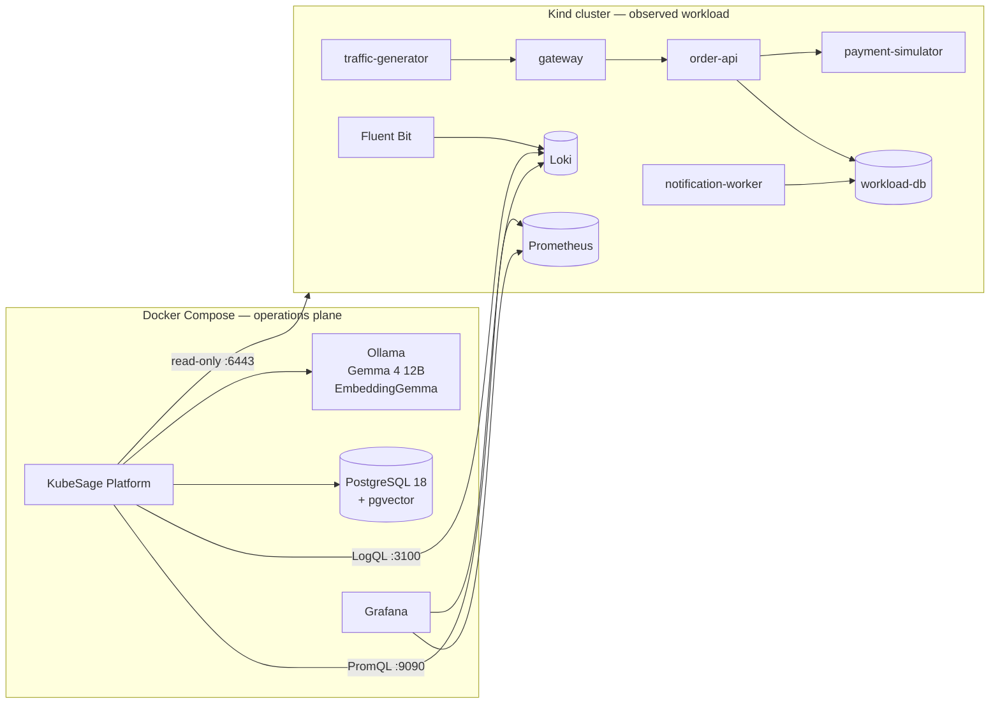
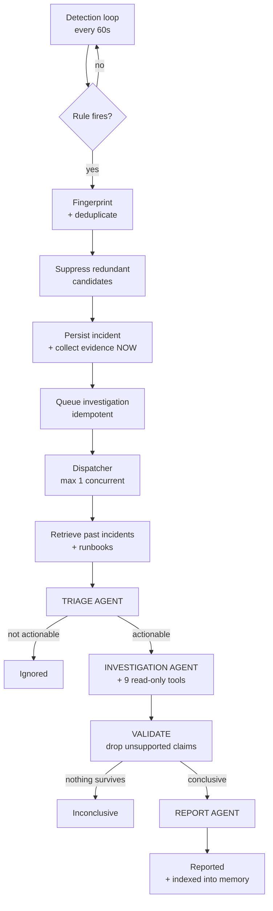

# KubeSage — AI Agent Assisted Kubernetes Incident Intelligence Platform

**AI Agent Assisted platform that watches a Kubernetes cluster, detects operational incidents with deterministic rules, and investigates them automatically using three AI agents backed by a local Gemma 4 model.**

## Contents

- [The problem](#the-problem)
- [What KubeSage actually does](#what-kubesage-actually-does)
- [A worked example](#a-worked-example)
- [How it works](#how-it-works)
- [Technology](#technology)
- [Getting started](#getting-started)
- [Command reference](#command-reference)
- [API reference](#api-reference)
- [Testing and verification](#testing-and-verification)
- [Performance expectations](#performance-expectations)
- [Limitations](#limitations)
- [Documentation](#documentation)

---

## The problem

When a service starts returning errors, the hard part is rarely *noticing*. Any
monitoring system can tell you the error rate went up. The hard part is working
out **which thing actually broke**.

Consider a request path like this one:

```
traffic → gateway → order-api → payment-simulator
                        ↓
                   workload-db
```

Now the payment simulator gets slow. What you observe is:

- the **gateway** returning 503s
- the **order API** returning 503s
- the **payment simulator** looking completely healthy — it is answering
  every request, just slowly

Two of the three services are shouting, and neither of them is broken. The one
that is causing the problem looks fine by every simple measure. An on-call
engineer has to notice that order-api's calls to payment-simulator take 4.8
seconds while its calls to the database take 9 milliseconds, and reason
backwards from there.

That reasoning step — from *symptom* to *cause* — is what KubeSage automates.

### Why not just ask an LLM?

Because a language model asked to "look at these logs and tell me what's wrong"
will produce a fluent, confident, plausible answer whether or not it is correct,
and you have no way to tell the difference. Fluency is not evidence.

KubeSage is built around that problem rather than around the model.

---

## What KubeSage actually does

The system is split down a hard line, and everything follows from where a given
job sits:

| Deterministic — ordinary code | Agentic — a language model |
| --- | --- |
| **Observe** — collect logs, metrics, cluster state | **Investigate** — form and rank hypotheses |
| **Detect** — thresholds, windows, fingerprints | **Explain** — write the operator-facing report |
| **Validate** — check every claim against evidence | |
| **Recover** — retries, state machine, restart recovery | |

The two halves fail differently. Ordinary code fails loudly and repeatably. A
model fails by producing something that reads well and is wrong. So the model is
never allowed to decide anything that has to be *true*:

- it cannot decide that an incident exists
- it cannot decide what evidence exists
- it cannot decide what gets stored

It reads evidence that was already collected, and returns an opinion which is
then checked against that evidence. Any claim citing something that does not
exist is discarded before it is stored.

Two consequences worth stating plainly:

1. **Detection works with the model completely stopped.** Verified — with Ollama
   killed, six incidents were still detected, persisted, and queued for
   investigation once the model returned.
2. **A report can be independently checked.** Every cited piece of evidence
   carries the exact Loki or Prometheus query that produced it, so you can paste
   it into Grafana and see the same data.

### Feature summary

| Capability | What it means concretely |
| --- | --- |
| **Autonomous** | Nothing waits for a prompt. Three triggers: startup, a five-minute schedule, and detection. |
| **Deterministic detection** | Six configurable rules over metrics, logs and cluster state. |
| **Incident deduplication** | Fingerprinting plus cooldown, so one outage is one incident, not one per minute. |
| **Cross-rule suppression** | One outage tripping five rules becomes the few candidates that actually differ. |
| **Three-agent investigation** | Triage decides whether to look; Investigation finds the cause; Report writes it up. |
| **Evidence grounding** | Unsupported claims are rejected, not softened. |
| **Semantic memory** | Past incidents and a runbook corpus in pgvector, retrieved during investigation. |
| **Read-only by construction** | The Kubernetes identity has no write verb at all. |
| **Survives failure** | Kill it mid-investigation: nothing is lost, nothing is duplicated. |

---

## A worked example

This is a real run, not an illustration. The command:

```bash
python kubesage.py scenario run payment-latency
```

slows the payment simulator to 3 seconds — past the order API's 2-second
timeout.

### 1. Detection notices, with no model involved

Within ~90 seconds the deterministic rules raise incidents. Note that the
incident is raised against **order-api**, because that is where the errors are:

```
[Critical] http_error_rate       order-api is returning 72.6 % server errors
[Medium  ] dependency_latency    9 'timeout' failures calling payment-simulator from order-api
[Medium  ] dependency_latency    payment-simulator 95th percentile latency is 3.44s
```

### 2. Evidence is collected deterministically

Before any agent runs, the platform gathers a correlated bundle. This alone is
close to a diagnosis:

```
KubernetesState  order-api pods Running, ready, 0 restarts      ← rules out a pod fault
Metric           72.6 % of requests returned 5xx over 5 minutes
Metric           calls to payment-simulator take 4.821s at p95  ← the culprit
Metric           calls to workload-database take 0.009s at p95  ← rules out the database
LogSignature     63x "Dependency payment-simulator timed out after <duration>"
```

### 3. Three agents run

```
Agent triage completed in 106s        → actionable, severity Critical
Agent investigation completed in 138s → ranked hypotheses with evidence ids
Agent report completed in 166s        → operator-facing report
Investigation finished in 412s with state Reported
```

### 4. The report

```
Root cause: performance degradation in `payment-simulator`, causing it to
            exceed the 2-second timeout configured in `order-api`.
Category:   dependency_latency
Confidence: 0.95
Evidence:   6 items, all resolving
```

**That is the correct answer, and it is not the workload the incident was raised
against.** The agent also inferred the 2-second timeout threshold, which is not
configured anywhere it can see — it derived it from log lines showing timeouts
at 2001ms.

### 5. It is checkable

```bash
curl "http://127.0.0.1:8081/reports/<id>/evidence"
```

```
met_4ca860bed341  order-api: calls to payment-simulator take 4.821s at p95
                  query: histogram_quantile(0.95, sum by (service, dependency, le)
                         (rate(kubesage_dependency_duration_seconds_bucket[5m])))
sig_e11d7e519f88  63x [error] Dependency payment-simulator timed out after <duration>
                  query: {namespace="kubesage-demo", container="order-api"} | json
```

Paste either query into Grafana and you see exactly what the agent saw.

### 6. Scored against ground truth the agents never see

```
[PASS] names the true root cause workload 'payment-simulator'
[PASS] root cause category is the right kind of problem
[PASS] does not blame a workload that was only a victim
[PASS] every cited evidence id resolves to real stored evidence — 6/6
[PASS] does not invent a pod failure (nothing restarted in this scenario)
```

---

## How it works

### Two planes

The AI platform runs **outside** the cluster it observes. An incident severe
enough to disrupt the cluster must not also disable the system meant to explain
it.



The operations plane reaches the cluster only through fixed host ports published
by Kind. Node IP addresses are never used — they change on every recreate.

### The pipeline



Two details carry most of the design weight:

- **Evidence is captured at detection time**, not when the investigation runs.
  On slow hardware the investigation may start minutes later, by which point the
  interesting log lines have aged out of the query window.
- **The report agent receives validated findings**, not the raw evidence pool,
  so it cannot introduce a cause the investigation never reached.

See [docs/architecture.md](docs/architecture.md) for the full picture.

---

## Technology

| Layer | Choice | Version |
| --- | --- | --- |
| Platform | .NET 10 / ASP.NET Core | `net10.0` |
| Agents | Microsoft Agent Framework | 1.17.0 |
| Model serving | Ollama | 0.32.13 |
| Reasoning model | Gemma 4 12B | `gemma4:12b` |
| Embeddings | EmbeddingGemma | `embeddinggemma:300m` (768-dim) |
| Database | PostgreSQL + pgvector | `pg18-trixie` / 0.8.6 |
| Cluster | Kind | node `v1.36.1` |
| Logs | Fluent Bit → Loki | 4.2.8 → 3.7.6 |
| Metrics | Prometheus | v3.13.2 |
| Dashboards | Grafana | 13.1.3 |
| Automation | Python (standard library only) | 3.11+ |

Every version is pinned — container images in [`versions.env`](versions.env),
NuGet packages in [`Directory.Packages.props`](Directory.Packages.props). No
floating tags, so a rebuild months from now produces the same binaries.

---

## Getting started

### Prerequisites

| Requirement | Notes |
| --- | --- |
| Docker Desktop | 12 GB+ allocated to containers recommended |
| `kind` | v0.32+ |
| `kubectl` | Any recent version |
| Python 3.11+ | Standard library only — no `pip install`, no venv |
| ~25 GB free disk | Models are ~8 GB |
| .NET 10 SDK | **Only** to run tests; the platform builds in a container |

An NVIDIA GPU is optional but makes investigations several times faster.

### Bootstrap

```bash
python kubesage.py bootstrap
```

20–40 minutes on a first run, almost all of it model download. It will:

1. **Preflight** — check tools, Docker, free ports, GPU
2. **Create the cluster** — three Kind nodes with fixed host port mappings
3. **Start PostgreSQL and Ollama** — first, so models download while nothing
   else needs the machine
4. **Pull models** — `gemma4:12b` (~7.6 GB) and `embeddinggemma:300m` (~0.6 GB)
5. **Build and deploy the workload** — five services plus the workload database
6. **Start the platform** — applying database migrations at startup

Safe to re-run: an existing cluster is left alone and models already present are
not re-downloaded.

### Observability and the read-only identity

These are cluster resources rather than part of the demo workload, so they are
applied separately:

```bash
kubectl --context kind-kubesage apply -f deploy/k8s/observability/
kubectl --context kind-kubesage apply -f deploy/k8s/rbac/

python -c "import sys; sys.path.insert(0,'automation'); \
from kubesage.config import load_settings; from kubesage import rbac; \
rbac.generate_kubeconfig(load_settings())"
```

The last command mints a token for the `kubesage-observer` service account and
writes a kubeconfig the platform mounts read-only. It contains a real credential
and is git-ignored.

### Confirm it works

```bash
python kubesage.py verify
```

Eighteen checks that probe real behaviour — including actually attempting a
forbidden `CREATE TABLE` and actually asking the Kubernetes API server whether
the observer may delete a pod.

Full detail in [docs/setup-guide.md](docs/setup-guide.md).

---

## Command reference

Every operation goes through one entry point. Run from the repository root.

| Command | What it does | Typical time |
| --- | --- | --- |
| `python kubesage.py preflight` | Check this machine has what is needed | seconds |
| `python kubesage.py bootstrap` | Create everything from nothing | 20–40 min |
| `python kubesage.py start` | Start an environment already bootstrapped | ~1 min |
| `python kubesage.py stop` | Stop the operations plane, keep all data | seconds |
| `python kubesage.py status` | What is running, endpoints, dependency health | seconds |
| `python kubesage.py verify` | 18 operational checks + retrieval gold set | 3–6 min |
| `python kubesage.py workload` | Rebuild, reload and restart the demo services | 5–10 min |
| `python kubesage.py scenario list` | Show the five failure scenarios | instant |
| `python kubesage.py scenario run <name>` | Inject a failure | seconds |
| `python kubesage.py scenario reset <name>` | Undo it (`all` clears everything) | ~1 min |
| `python kubesage.py scenario check all` | Run each scenario end to end and verify | ~20 min |
| `python kubesage.py e2e` | The two critical end-to-end workflows | ~30 min |
| `python kubesage.py cleanup [--keep-models]` | Delete the cluster, containers, volumes | 1–2 min |

`stop` deliberately leaves the Kind cluster running — stopping and starting Kind
nodes is slow and error-prone, and leaving them up costs little.

---

## API reference

Base URL `http://127.0.0.1:8081`. All endpoints are read-only except
`/analysis/run`, which exists for diagnostics.

| Endpoint | Purpose |
| --- | --- |
| `GET /health/live` | Process is alive. Never checks dependencies. |
| `GET /health/ready` | Can the platform do its job — i.e. can it persist? |
| `GET /health/detail` | Every check, including ones readiness excludes |
| `GET /incidents` | List incidents, `?state=` and `?limit=` |
| `GET /incidents/{id}` | One incident plus all its evidence |
| `GET /reports` | List reports, newest first |
| `GET /reports/latest` | The most recent report of any kind |
| `GET /reports/{id}/evidence` | A report with its citations resolved |
| `GET /evidence` | Correlated bundle for a workload |
| `GET /evidence/kubernetes` | Pods, deployments and events only |
| `GET /evidence/log-signatures` | Repeated error patterns with counts |
| `GET /cluster/status` | Open incidents and work queue depth |
| `POST /analysis/run` | Force a detection pass (diagnostics) |

Full request and response shapes with worked examples:
[docs/api-reference.md](docs/api-reference.md).

`/health/detail` is worth knowing about. "Ready" and "fully working" are
different states: with Ollama down the platform is correctly *Ready* — it still
detects and records incidents — but investigations are only being queued. That
difference is invisible from readiness alone, by design.

---

## Testing and verification

```bash
dotnet test                              # 96 unit + 25 integration + 11 API
python kubesage.py verify                # 18 operational checks
python kubesage.py scenario check all    # all five scenarios end to end
python kubesage.py e2e                   # the two critical workflows
```

`dotnet test` needs Docker running — the integration and API tests start
throwaway PostgreSQL containers. It does not need the cluster or Ollama.

| Layer | Count | What it protects |
| --- | --- | --- |
| Unit | 96 | Detection rules, state transitions, fingerprints, redaction, query guards |
| Integration | 25 | PostgreSQL, pgvector search, durable queue, restart recovery |
| API / component | 11 | HTTP contracts, behaviour when dependencies are down |
| End-to-end | 2 | The workflows that constitute the project's claim |
| Operational | 18 checks | Whether the deployed system actually works |
| AI evaluation | 5 + 5 | Retrieval quality and investigation correctness |

Reasoning behind the distribution, and the defects each layer has caught, in
[docs/testing-strategy.md](docs/testing-strategy.md).

---

## Performance expectations

So that "slow" is not mistaken for "broken". Measured on a GTX 1060 6GB with
13.6 GB of Docker memory:

| Operation | Expected |
| --- | --- |
| Model cold load | ~34 s |
| Triage agent | 80–110 s |
| Investigation agent | 110–140 s |
| Report agent | 110–170 s |
| **Full investigation** | **~7 minutes** |
| Detection pass | 1–3 s |
| Embedding a query | < 1 s warm, ~58 s if the model must be swapped in |

The model runs at roughly **6 tokens/sec** with a 49% CPU / 51% GPU split — the
card is too small to hold a 12B model entirely. If an investigation takes 20+
minutes, the model has probably lost GPU residency; check `ollama ps`.

---

## Limitations

Real, and worth knowing before judging the output.

**Speed.** One investigation takes 5–10 minutes. This is the model and the
hardware, not something tuning removes.

**Concurrency of one.** A local 12B model gains nothing from parallel
investigations except memory pressure and timeouts.

**The AI can be wrong.** Validation guarantees a claim *cites real evidence*,
not that the conclusion is correct. Reports carry a confidence value and
alternative hypotheses, and `Inconclusive` is a real outcome the system does
reach and store.

**Small sample.** Results here come from a handful of controlled scenarios on
one machine. Genuinely measured, but not a long-running production trial.

**A demo workload.** The five services exist to generate realistic operational
evidence, not to model a real business.

**Single cluster.** No multi-cluster support.

**Local development only.** Credentials are plain text in compose files, Grafana
allows anonymous access, and the API is unauthenticated. See
[docs/production-considerations.md](docs/production-considerations.md).

---

## Documentation

**Start here**

| Document | Read it when |
| --- | --- |
| [architecture.md](docs/architecture.md) | You want to understand how the pieces fit together |
| [setup-guide.md](docs/setup-guide.md) | You are installing, operating or cleaning up |
| [codebase-guide.md](docs/codebase-guide.md) | You are about to change the code |

**Reference**

| Document | Covers |
| --- | --- |
| [api-reference.md](docs/api-reference.md) | Every endpoint, with request and response examples |
| [configuration.md](docs/configuration.md) | Every setting, its default, and what it affects |
| [failure-scenarios.md](docs/failure-scenarios.md) | The five scenarios and the evidence each produces |

**Deeper concerns**

| Document | Covers |
| --- | --- |
| [design-decisions.md](docs/design-decisions.md) | Choices made, alternatives rejected, and what each cost |
| [security.md](docs/security.md) | Read-only access, redaction, prompt-injection handling |
| [observability.md](docs/observability.md) | The telemetry model and label cardinality |
| [incident-memory.md](docs/incident-memory.md) | Semantic memory and retrieval |
| [testing-strategy.md](docs/testing-strategy.md) | Test layers and AI evaluation |
| [troubleshooting.md](docs/troubleshooting.md) | What goes wrong locally and how to fix it |
| [production-considerations.md](docs/production-considerations.md) | What is simplified and what production needs |
