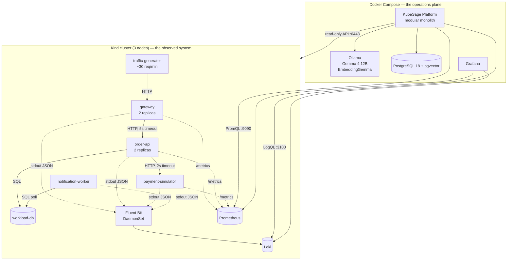
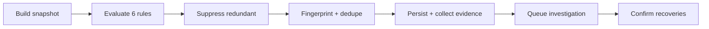
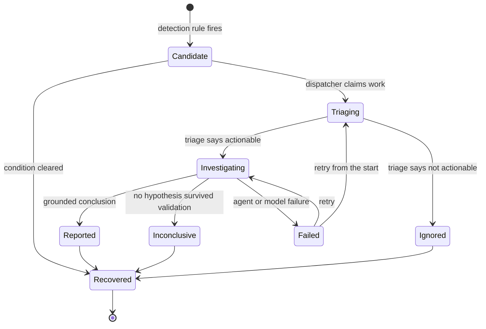
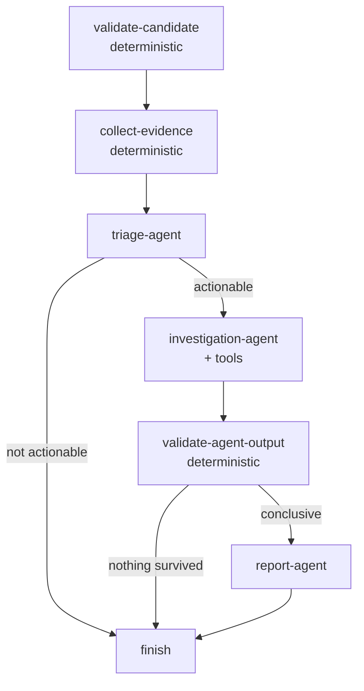

# Architecture

How KubeSage is put together, and why each piece sits where it does.

- [The organising principle](#the-organising-principle)
- [Two planes](#two-planes)
- [Module map](#module-map)
- [The evidence model](#the-evidence-model)
- [Detection](#detection)
- [The incident domain](#the-incident-domain)
- [Durable work processing](#durable-work-processing)
- [The investigation workflow](#the-investigation-workflow)
- [Semantic memory](#semantic-memory)
- [Configuration and startup](#configuration-and-startup)
- [Data storage](#data-storage)

---

## The organising principle

Every part of the system sits on one side of a line:

| Deterministic (ordinary code) | Agentic (a language model) |
| --- | --- |
| Observe — collect logs, metrics, cluster state | Investigate — form and rank hypotheses |
| Detect — thresholds, windows, fingerprints | Explain — write the operator-facing report |
| Validate — check every claim against evidence | |
| Recover — retries, state transitions, restart recovery | |

The line exists because the two halves fail differently. Ordinary code fails
loudly and repeatably. A model fails by producing something fluent and wrong.

So a model is never allowed to decide anything that has to be true. It cannot
decide an incident exists, cannot decide what evidence exists, and cannot decide
what gets stored. It reads prepared evidence and returns a structured opinion,
which deterministic code then checks.

The most visible consequence: **detection works with Ollama stopped.** That is
not a degraded mode added later — it falls out of the split. Verified by killing
Ollama and confirming six incidents were still detected, persisted and queued.

---

## Two planes



The platform runs **outside** the cluster on purpose: an incident bad enough to
disrupt the cluster must not also disable the thing explaining it.

### Crossing between planes

The two planes are separate Docker networks. Kind publishes fixed host ports
(`deploy/kind/cluster.yaml`), and the operations plane reaches them via
`host.docker.internal`:

| Purpose | Kind nodePort | Host port | Reached as |
| --- | --- | --- | --- |
| Kubernetes API | — | 6443 | `https://host.docker.internal:6443` |
| Loki | 30100 | 3100 | `http://host.docker.internal:3100` |
| Prometheus | 30090 | 9090 | `http://host.docker.internal:9090` |
| Demo gateway | 30080 | 8080 | for humans, to confirm traffic |

Kind node IP addresses are never referenced — they change on every recreate and
are not predictably routable from another Docker network.

Two details make this work:

- The API server certificate carries `host.docker.internal` as a subject
  alternative name (a `certSANs` entry in the kind config), so **TLS
  verification stays enabled**.
- Compose services declare `extra_hosts: host.docker.internal:host-gateway`, so
  the name resolves on Linux as well as Docker Desktop.

---

## Module map

One deployable ASP.NET Core application. Modules are folders with narrow
interfaces, not separate services — splitting this into microservices would add
deployment and debugging cost without solving a problem at this scale.

```
src/KubeSage.Platform/
├── Program.cs                  host construction, migrations, endpoint mapping
├── Configuration/              the whole options tree + cross-field validation
├── Api/                        health, evidence, incidents, reports
└── Modules/
    ├── Telemetry/              Loki, Prometheus, Evidence, redaction, query guards
    ├── Kubernetes/             read-only cluster state
    ├── Detection/              six rules, snapshot building, suppression
    ├── Incidents/              domain model, state machine, fingerprints, repository
    ├── Persistence/            migrations, the durable work queue
    ├── AgentWorkflows/         agents, workflow graph, tools, output validation
    ├── Retrieval/              embeddings, pgvector, semantic search
    └── Reporting/              investigations, agent executions, hypotheses, reports
```

| Module | Key types | Responsibility |
| --- | --- | --- |
| `Telemetry` | `LokiClient`, `PrometheusClient`, `Evidence`, `EvidenceCollector`, `SensitiveDataRedactor`, `TelemetryQuery`, `LogSignature` | Fetch and normalise observations; enforce query bounds; redact secrets |
| `Kubernetes` | `KubernetesEvidenceClient` | Pod state, events, deployment status — reads only |
| `Detection` | `DetectionEngine`, `IDetectionRule` and its six implementations, `DetectionSnapshot`, `CandidateSuppression` | Turn telemetry into incident candidates |
| `Incidents` | `Incident`, `IncidentState`, `IncidentFingerprint`, `IncidentRepository` | The domain, its lifecycle, and deduplication |
| `Persistence` | `DatabaseMigrator`, `WorkQueue` | Schema and durable work |
| `AgentWorkflows` | `IncidentAgents`, `InvestigationWorkflow`, `InvestigationTools`, `AgentOutputValidator`, `OllamaChatClientAdapter` | The AI layer and its boundaries |
| `Retrieval` | `EmbeddingClient`, `SemanticMemoryRepository`, `MemoryRetriever`, `SemanticMemoryIndexer` | Historical knowledge |
| `Reporting` | `ReportRepository` | Persist what the AI concluded |

Each module exposes an `Add<Module>()` extension registered in `Program.cs`, so
wiring lives with the module rather than accumulating in one file.

---

## The evidence model

`Modules/Telemetry/Evidence.cs` defines the backbone of the whole project.

```csharp
public sealed record Evidence
{
    public required string Id { get; init; }              // deterministic, content-derived
    public required EvidenceKind Kind { get; init; }
    public required string Source { get; init; }          // loki | prometheus | kubernetes | memory
    public required DateTimeOffset ObservedAtUtc { get; init; }
    public required string Summary { get; init; }         // already redacted
    public string? Workload { get; init; }
    public IReadOnlyDictionary<string, string> Attributes { get; init; }
    public string? Query { get; init; }                   // how to reproduce this
    public int RedactedValueCount { get; init; }
}
```

Seven kinds, ordered by information per item:

| Kind | Example | Typical count |
| --- | --- | --- |
| `KubernetesState` | `pod order-api-7b6 phase=Running ready=True restarts=0` | a few |
| `KubernetesEvent` | `[Warning] BackOff on Pod order-api-7b6` | tens |
| `Metric` | `order-api: calls to payment-simulator take 4.821s at p95` | a few |
| `LogSignature` | `63x [error] Dependency payment-simulator timed out after <duration>` | tens |
| `HistoricalIncident` | a past incident summary from semantic memory | 0–5 |
| `Runbook` | a runbook section | 0–5 |
| `LogSample` | one raw log line | hundreds |

### Identifiers are deterministic

```csharp
Evidence.CreateId(kind, source, params ReadOnlySpan<string?> parts)
// → "met_4ca860bed341", "sig_e11d7e519f88", "log_1a5ba969d457"
```

The identifier is a hash of the content that defines the observation. Collecting
the same observation twice yields the same id, so an agent cannot inflate
apparent corroboration by asking for the same thing repeatedly. Prefixes (`met_`,
`sig_`, `log_`, `k8s_`, `evt_`, `hist_`, `book_`) make the kind readable at a
glance.

Metric identifiers include a minute-rounded time bucket, so collecting the same
metric twice seconds apart is one fact, not two.

### Every item carries its query

This is what makes a report checkable rather than merely readable. A human can
paste the stored query into Grafana and see the same data the agent saw.

### Redaction happens before a model ever sees it

`SensitiveDataRedactor` strips connection-string passwords, bearer tokens, JWTs,
authorization headers, API-key assignments, private key blocks and AWS keys —
and strips control characters so log text cannot forge prompt structure.

Context is preserved (`Password=[REDACTED]`, not a vanished line), and the count
of removed values is recorded so "the log looked empty" is distinguishable from
"the log was redacted".

### Log signatures compress repetition

`LogSignature.Normalise` replaces the parts that change on every occurrence:

```
Dependency payment-simulator timed out after 2001.29ms while processing ord_07c5
Dependency payment-simulator timed out after 1998.44ms while processing ord_09a8
    ↓
Dependency payment-simulator timed out after <duration> while processing <id>
```

Both collapse into one signature reported once with a count. `63x the same
timeout` is better evidence than 63 near-identical lines and costs a fraction of
the model's context.

---

## Detection

`DetectionEngine.RunPassAsync` runs every 60 seconds:



### The snapshot

`DetectionSnapshot` is gathered first so rules stay pure functions of their
input — cheap and meaningful to unit test. Each source is optional: a pass with
only Kubernetes data still catches crash loops and OOM kills, which is much
better than no detection while Prometheus restarts.

It also carries `PreviousRestartCounts`, persisted in the `detection_state`
table, so rules can measure the *increase* in restarts rather than the absolute
count. Without that, a pod that crash-looped last week would raise an incident
every minute today.

### The six rules

All in `Modules/Detection/DetectionRules.cs`, all implementing `IDetectionRule`.
None performs I/O or calls a model.

| Rule | Fires when | Default threshold |
| --- | --- | --- |
| `HttpErrorRateRule` | 5xx share exceeds the threshold | 10%, min 20 requests |
| `LatencyRule` | p95 request duration too high | 1.5s |
| `DependencyFailureRule` | Failures calling a named dependency | 5 in the window |
| `PodRestartRule` | Restart increase, CrashLoopBackOff, or OOMKilled | +2 restarts |
| `ReadinessRule` | Pods unready **without** restarting | 1 pod |
| `RepeatedErrorSignatureRule` | One normalised error repeats | 10 occurrences |

Three details worth noting:

- **Only 5xx counts** toward the error rate. The traffic generator deliberately
  sends invalid requests, and counting those 4xx would make healthy periods look
  like incidents.
- **`MinimumRequestSample`** stops one failure out of two reading as a 50% error
  rate.
- **`ReadinessRule` requires no restarts.** A crash-looping pod is also unready,
  but reporting that as a readiness problem describes the symptom instead of the
  cause — the restart rule owns that case.

`DependencyFailureRule` is the most valuable one, because it names the
dependency. It also raises severity when several independent callers fail
against the same dependency, which is far stronger evidence than one caller's
errors.

### Suppression

One outage legitimately trips several rules. Measured: scaling the workload
database to zero produced **twelve** candidates in a single pass. Every one was
a true observation; only one was the incident.

`CandidateSuppression` applies a precedence order — most explanatory first —

```
OutOfMemory > DependencyUnavailable > DependencyLatency > PodRestartLoop
            > ReadinessFailure > HttpErrorRate > RepeatedErrorSignature
```

and drops generic log-signature candidates for workloads a more explanatory rule
already covered, then collapses multiple signatures per workload to the most
frequent. Twelve became **four**, each genuinely distinct.

Results are ordered by severity then explanatory power, so when model capacity is
limited the most informative incident is investigated first.

---

## The incident domain

### Candidate versus incident

`IncidentCandidate` is what a rule produces — a value object saying "here is a
condition I observed". `Incident` is the persisted aggregate. Whether a candidate
becomes a new incident, updates an existing one, or is suppressed as a duplicate
is decided afterwards by `IncidentRepository.RecordCandidateAsync`. Keeping them
apart is what lets a rule stay simple and stateless.

### Fingerprinting

```csharp
IncidentFingerprint.Create(category, namespaceName, affectedWorkloads, errorSignature?)
```

Inputs are chosen to stay stable while a condition persists but differ between
distinct conditions. Workloads are sorted and deduplicated so discovery order
does not matter. **Timestamps, pod names, counts and measured values are
deliberately excluded** — they change on every evaluation, and including any of
them would make one ongoing outage look new every minute.

The tension is real in both directions:

- too **coarse** → a genuinely different incident is swallowed as a duplicate and
  never investigated
- too **fine** → one outage raises an incident every minute, each queuing its own
  multi-minute investigation

### The state machine



`IncidentStateMachine.EnsureTransition` **throws** on an invalid move rather than
returning false — an invalid transition is a programming error, and letting it
through would corrupt the one record that has to stay trustworthy.

`Failed` is retryable. The other end states are terminal. Recovery is decided by
elapsed time, not by an agent: a condition not observed for
`RecoveryConfirmationMinutes` simply stops being current.

Severity may be **raised** by triage but never lowered below what the rules
measured. A deterministic threshold that fired is a fact.

---

## Durable work processing

Everything autonomous goes through a PostgreSQL-backed queue rather than
executing inline.

| Requirement | Mechanism |
| --- | --- |
| Survive a crash | The work item is a committed row |
| No duplicate work | Partial unique index on `(kind, dedup_key)` for unfinished rows |
| Retry with backoff | `attempt`, `max_attempts`, `available_at_utc` (30s, 60s, 120s… capped at 900s) |
| Backpressure | Claim at most `MaxConcurrent` rows |
| Recover abandoned work | Expired `leased_until_utc` makes a row claimable again |

The claim uses `SELECT ... FOR UPDATE SKIP LOCKED`, which lets several workers
share the queue without blocking each other or handing the same row to two of
them.

The partial index covers only `Pending` and `Claimed` rows, so the same
`dedup_key` may legitimately be reused later — the same incident recurring next
week is new work, not a duplicate of something finished long ago.

### Two layers of recovery

**Lease expiry** handles a process that died mid-investigation: the row becomes
claimable again. `ReleaseOwnStaleLeasesAsync` at startup speeds this up for rows
this worker itself was holding, rather than waiting out a 40-minute lease.

**`StartupRecoveryService`** closes a gap the queue cannot close alone. If a work
item is marked `Completed` and the process then dies mid-investigation, nothing
reclaims the item (it is finished) and nothing re-detects the incident
(deduplication correctly suppresses it, since it is still open). The incident is
stranded — real, unresolved, invisible. Recovery reconciles incident state
against the queue at startup and requeues anything unfinished.

Because enqueue is idempotent, recovery cannot create duplicates. A real kill
test produced:

```
Startup recovery complete: 7 unfinished incident(s), 0 requeued,
7 already had queued work
```

### Long investigations renew their lease

An investigation can legitimately outlast its lease on slow hardware. The
dispatcher renews in the background at roughly a third of the lease interval, so
two renewals can fail before work is considered abandoned.

---

## The investigation workflow

Built with `Microsoft.Agents.AI.Workflows` — a graph of executors where
deterministic steps and agent steps alternate.



### Step by step

**`validate-candidate`** — skips work for a condition that already recovered.

**`collect-evidence`** — loads evidence stored at detection time, adds a fresh
bundle, then seeds semantic memory. Historical context is seeded *here* rather
than left to the agent's tools, because an investigation that makes no tool calls
(common when pre-collected evidence suffices) would otherwise never see the
platform's own history.

**`triage-agent`** — gets a deliberately small slice: 15 items, runbooks
excluded. It only decides whether to look closer, and that decision does not
improve with sixty items while the call time grows with each one. Sending the
full pool once pushed a triage call past the model timeout.

**`investigation-agent`** — the only agent with tools. Gets up to
`MaxEvidenceItems` (60), selected by `EvidenceSelector` in priority order.

**`validate-agent-output`** — the critical step, described below.

**`report-agent`** — receives *validated findings*, not the raw evidence pool, so
it cannot introduce a cause the investigation never reached.

### Evidence grounding

`AgentOutputValidator` is the mechanism behind the project's central claim.

Schema-constrained generation guarantees the **shape** of an answer. Nothing
about it guarantees the **content** is true — a model can produce a perfectly
well-formed hypothesis citing identifiers it invented.

```
for each hypothesis:
    real     = cited ids that exist in the collected evidence
    invented = the rest
    if invented → remove them, record the problem
    if real is empty → REJECT the hypothesis entirely
if no hypothesis survives → the investigation is Inconclusive,
                            regardless of what the model asserted
```

The validator is strict in one direction and forgiving in the other: an invented
identifier is removed and an unsupported claim rejected, but a merely *uncertain*
hypothesis is kept, because ranking uncertain possibilities is legitimate
investigation work.

Problems are carried forward rather than discarded — a report produced from
output that needed correcting should say so.

### The tool allow-list

Nine tools in `InvestigationTools`. There is no generic query tool, no shell, no
`kubectl`, and no mutating operation is expressible.

| Tool | Returns |
| --- | --- |
| `SearchLogs` | Logs for one workload, filtered by level and substring |
| `SearchLogsAroundTimestamp` | Logs surrounding a moment — often more useful than keyword search |
| `GetPodStatus` | Phase, readiness, restart count, termination reason, memory limit |
| `GetRestartHistory` | Restart counts across all pods |
| `GetKubernetesEvents` | BackOff, Unhealthy, Killing |
| `GetDeploymentStatus` | Desired versus ready replicas |
| `GetServiceMetrics` | Error rate, latency percentiles, dependency timings |
| `SearchSimilarIncidents` | Past incidents from semantic memory |
| `SearchRunbooks` | Runbook guidance |

Every call passes through `InvestigationBudget` (default 20 calls per
investigation). Exhausting it returns a message telling the agent to conclude
from what it has, rather than failing the run.

A rejected call returns **text**, not an exception, so an agent that asks for
something out of bounds learns why and adapts instead of collapsing the whole
investigation on one bad argument.

### The model adapter

`OllamaChatClientAdapter` implements `IChatClient` so the Agent Framework can
drive Ollama. It exists as its own class because it encodes two behaviours
specific to Gemma 4 that a generic client gets wrong:

1. **Gemma 4 is a reasoning model.** It writes reasoning to a separate `thinking`
   field. The `/api/generate` endpoint returns an empty `response` for it, which
   looks exactly like a broken model. Only `/api/chat` separates the two.
2. **`think` is sent explicitly, defaulting to false.** Reasoning tokens generate
   at the same few tokens per second as everything else, so leaving it on roughly
   doubles every call.

The reasoning content is read, its length logged for diagnostics, and then
**discarded**. There is no column for chain-of-thought anywhere in the schema.

---

## Semantic memory

Two sources: a curated runbook corpus compiled into the assembly, and the
platform's own past incidents.

**Embedded:** incident summaries, root causes, recommended actions, normalised
error signatures, runbook sections.

**Not embedded:** raw log lines, metric samples, individual Kubernetes events.
Embedding those would be expensive, grow without bound, and make retrieval
*worse* — thousands of near-identical lines would crowd out the one summary that
answers the question.

Storage is a single `semantic_memory` table holding both kinds, with relational
facets (`workload`, `category`, `root_cause_category`, `severity`) beside the
`vector(768)` column so a search can be narrowed by SQL before comparing vectors.

The index is **HNSW**, not IVFFlat: IVFFlat needs training data to build its
lists and behaves poorly on a small growing corpus, which is what this is on a
fresh install.

Full treatment in [incident-memory.md](incident-memory.md).

---

## Configuration and startup

Every tunable value lives in one options tree (`KubeSageOptions`) bound from the
`KubeSage` configuration section and validated at startup.

`KubeSageOptionsValidator` is hand-written rather than using
`ValidateDataAnnotations`, because that helper only inspects the top-level object
and would silently ignore every attribute on the nested sections — which is where
all the real settings live.

Beyond per-field ranges it checks relationships **between** settings. Those are
the mistakes that actually hurt: each value looks reasonable alone but the
combination misbehaves in a way that is hard to spot later.

| Rule | Why |
| --- | --- |
| `WorkLeaseSeconds` ≥ `Investigation.TimeoutSeconds` | A shorter lease lets a running investigation be claimed twice |
| `DeduplicationCooldownMinutes` ≥ `EvaluationWindowMinutes` | Otherwise the same condition raises an incident every pass |
| `RecoveryConfirmationMinutes` ≥ `EvaluationWindowMinutes` | Otherwise incidents flap open and closed |
| `EvaluationWindowMinutes` ≤ `MaxQueryRangeMinutes` | Otherwise rules evaluate truncated data as if complete |
| `Investigation.TimeoutSeconds` ≥ `Ollama.RequestTimeoutSeconds` | Otherwise no investigation can ever finish |
| `AllowedNamespaces` contains `WorkloadNamespace` | Otherwise evidence collection is blocked for the observed workload |

This caught a real defect: the shipped C# defaults were self-contradictory —
lease 900s against a timeout of 1800s.

### Startup order

```
1. Build host, bind and validate configuration   (fails fast on bad config)
2. Run database migrations                        (advisory lock, checksums)
3. Reload Npgsql type cache                       (so pgvector's type is known)
4. Map endpoints
5. Start background services
```

Step 3 matters: Npgsql reads the database's type catalogue once and caches it.
The baseline migration is what creates the pgvector extension, so on a brand new
database the reload is what prevents an unhelpful *"data type name 'vector' could
not be found"* the first time an embedding is written.

### Background services

| Service | Cadence | Job |
| --- | --- | --- |
| `DetectionLoop` | every 60s | Run a detection pass |
| `AnalysisScheduler` | startup + every 300s | Queue cluster analysis |
| `InvestigationDispatcher` | polls every 5s | Claim and run work |
| `StartupRecoveryService` | once, 10s after start | Requeue unfinished incidents |
| `RunbookIndexingService` | once at start | Embed changed runbook sections |

All of them survive exceptions. A dispatcher that died would silently stop all
autonomous analysis while the platform still looked healthy.

---

## Data storage

Raw operational data stays in the system built for it.

| Data | Home | Retention | Copied to PostgreSQL? |
| --- | --- | --- | --- |
| Log lines | Loki | 7 days | Only the slice attached to an incident |
| Metric samples | Prometheus | 6 hours | Never — only computed summaries |
| Cluster state | Kubernetes API | — | Only as evidence on an incident |
| Incidents, reports, memory | PostgreSQL | Indefinite | — |

### Tables

| Table | Holds |
| --- | --- |
| `incidents` | The aggregate: fingerprint, state, severity, signals, occurrence count |
| `incident_evidence` | Evidence copied at detection time, with its query |
| `investigations` | One row per attempt, with duration and unavailable sources |
| `agent_executions` | Per agent: duration, tool calls, validated result — **no reasoning** |
| `hypotheses` | Ranked causes with confidence and evidence ids |
| `reports` | Incident reports and cluster reports, distinguished by `kind` |
| `work_items` | The durable queue |
| `detection_state` | Previous restart counts, so rules measure the increase |
| `semantic_memory` | Embeddings plus relational facets |
| `platform_metadata` | Installation facts |
| `kubesage_schema_history` | Applied migrations with checksums |

Evidence is **copied** rather than only referenced because Loki and Prometheus
age their data out, and a report read next week must still show what it was
based on. This is the one deliberate exception to "raw telemetry stays put", and
it is bounded to the slice that supported a conclusion.

### Migrations

Plain SQL embedded in the assembly, applied by `DatabaseMigrator`:

| Migration | Adds |
| --- | --- |
| `001_baseline.sql` | pgvector extension, `platform_metadata` |
| `002_incident_domain.sql` | Incidents, evidence, investigations, hypotheses, reports, work queue |
| `003_semantic_memory.sql` | `semantic_memory` with the HNSW index |
| `004_cluster_reports.sql` | Makes report incident links optional, with a check constraint |

The runner provides ordering, idempotency, drift detection via checksum, and a
PostgreSQL advisory lock so two starting instances cannot race. A script edited
after being applied is **refused** — that would leave two databases in different
shapes while both claim to be up to date.

Migrations run with the schema-owner connection string; everything else uses a
low-privilege role that cannot alter the schema.
